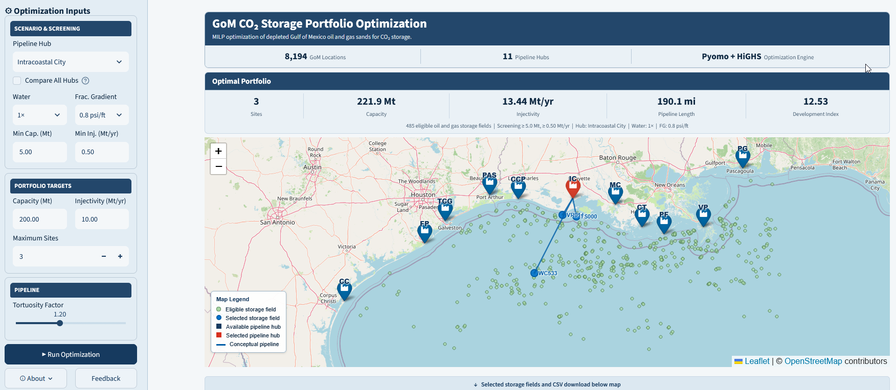
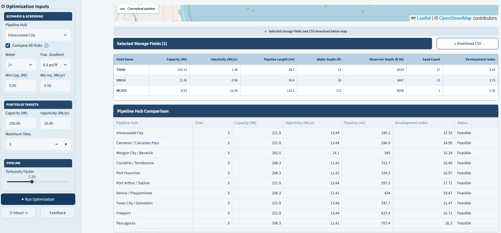

# Gulf of Mexico CO₂ Storage Portfolio Optimization

An interactive **engineering decision-support platform** that applies Mixed-Integer Linear Programming (MILP) to identify optimized portfolios of depleted Gulf of Mexico (GoM) oil and gas sands for potential CO₂ storage.

The application integrates **subsurface screening, spatial analysis, infrastructure considerations, and mathematical optimization** to identify storage portfolios that satisfy user-defined capacity and injectivity requirements while minimizing a comparative development index.

## 🌐 Live Application

**[Launch the GoM CO₂ Storage Portfolio Optimization App](https://gom-co2-portfolio-optimization.streamlit.app/)**

---

## Application Overview

The platform evaluates **8,194 depleted oil and gas sand locations** across the Gulf of Mexico and connects engineering screening with portfolio-level optimization.

Users can specify:

- Gulf Coast pipeline hub
- Storage-capacity target
- Injectivity target
- Maximum number of storage sites
- Minimum site capacity
- Minimum site injectivity
- Water-production scenario
- Fracture-gradient scenario
- Pipeline tortuosity factor

The optimization engine then identifies a portfolio satisfying the specified engineering constraints while minimizing the total Development Index.

---

## Optimization Problem

For each candidate storage site *i*, a binary decision variable is defined as:

**xᵢ = 1** if site *i* is selected  
**xᵢ = 0** otherwise

The MILP minimizes:

> **Σ CIᵢ xᵢ**

where **CIᵢ** is the Development Index associated with candidate site *i*.

Subject to:

### Storage Capacity

> **Σ Cᵢ xᵢ ≥ Capacity Target**

### Injectivity

> **Σ Iᵢ xᵢ ≥ Injectivity Target**

### Maximum Number of Storage Sites

> **Σ xᵢ ≤ Maximum Sites**

where:

- **Cᵢ** = storage capacity of site *i*
- **Iᵢ** = injectivity of site *i*
- **CIᵢ** = Development Index of site *i*

The resulting optimization problem is solved using **Pyomo** with the **HiGHS** MILP solver.

---

## Development Index

Rather than representing project-level capital cost, the Development Index provides a consistent comparative metric for portfolio optimization.

It combines four engineering components:

> **Development Index = Pipeline + Offshore + Subsurface + Complexity**

### Pipeline

Represents the relative infrastructure burden associated with connecting an offshore storage location to the selected Gulf Coast hub.

Hub-to-site distances are calculated geodesically and adjusted using a user-defined pipeline tortuosity factor.

### Offshore Development

Represents increasing offshore development burden with increasing water depth.

### Subsurface Development

Represents increasing drilling and subsurface development burden with increasing reservoir depth.

### Storage-Site Complexity

Introduces an additional development penalty for locations containing multiple candidate storage sands.

The Development Index is intended for **comparative screening and optimization**, not as a substitute for detailed project economics or FEED-level cost estimation.

---

## Gulf Coast Pipeline Hub Comparison

The application can independently solve the portfolio optimization problem for **11 representative Gulf Coast pipeline hubs** while holding the engineering screening criteria and portfolio targets constant.

This allows users to evaluate how alternative infrastructure connection points affect:

- Selected number of storage sites
- Portfolio storage capacity
- Portfolio injectivity
- Total conceptual pipeline mileage
- Overall Development Index

Each hub represents an independent optimization scenario. The comparison is **not a shared pipeline-network optimization**.

---

## Engineering Workflow

The application follows the workflow:

**BOEM GoM Sand Database**  
↓  
**Engineering Scenario Selection**  
↓  
**Site-Level Capacity & Injectivity Screening**  
↓  
**Hub-to-Site Spatial Analysis**  
↓  
**Development Index Calculation**  
↓  
**MILP Portfolio Optimization**  
↓  
**Interactive Spatial Decision Support**

This architecture separates the underlying reservoir-screening calculations from the portfolio-selection problem.

---

## Technology Stack

- **Python**
- **Streamlit**
- **Pandas**
- **Pyomo**
- **HiGHS**
- **Folium**
- **Streamlit-Folium**
- Geospatial distance calculations
- Mixed-Integer Linear Programming

---

## Scope and Limitations

The underlying screening database represents **depleted Gulf of Mexico oil and gas sands**. Regional saline formations, which may provide substantially larger storage resources, are outside the scope of this application.

The Development Index is a **relative decision-support metric** and should not be interpreted as project-level CapEx or total development cost.

Pipeline connections displayed on the map represent **conceptual hub-to-site connections**. Reported pipeline mileage incorporates the selected tortuosity factor but does not represent engineered pipeline routing.

Storage capacity and injectivity are screening-level estimates and remain subject to site-specific characterization, reservoir simulation, geomechanical evaluation, well design, regulatory review, and detailed economic analysis.

---

## Technical Methodology

Detailed engineering assumptions, spatial calculations, Development Index formulation, and MILP methodology are documented in:

**[Optimization Methodology Guide](Optimization_Methodology_Guide_v1.0.md)**

---

## Related Project

This optimization platform builds on the engineering screening framework developed for the **Gulf of Mexico CO₂ Storage Decision Support Platform**, which evaluates storage capacity, injectivity, reservoir characteristics, and engineering screening scenarios across the GoM depleted oil and gas sand database.

---

## Author

**Muhammad Zulqarnain, Ph.D.**

Petroleum Engineering · CO₂ Geological Storage · Reservoir Simulation · Data Science & Optimization